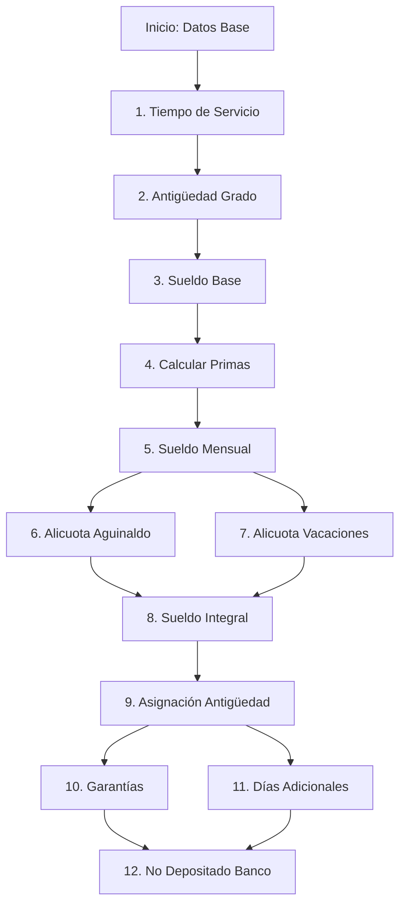
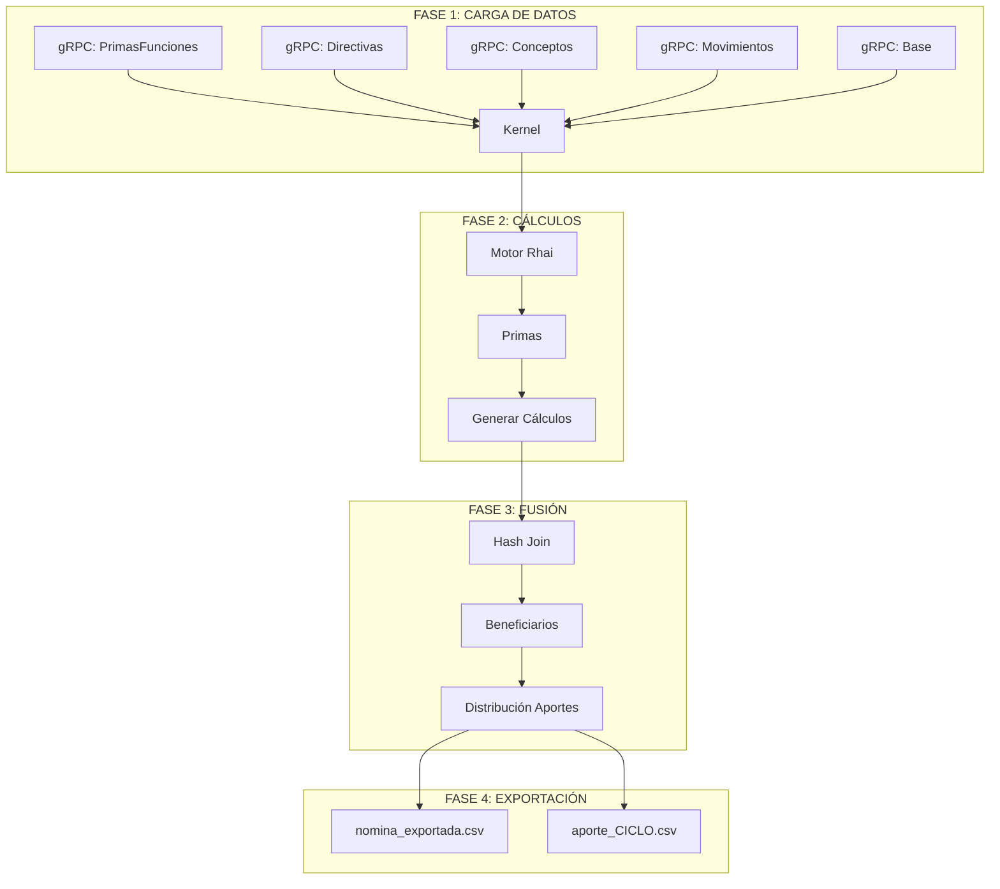
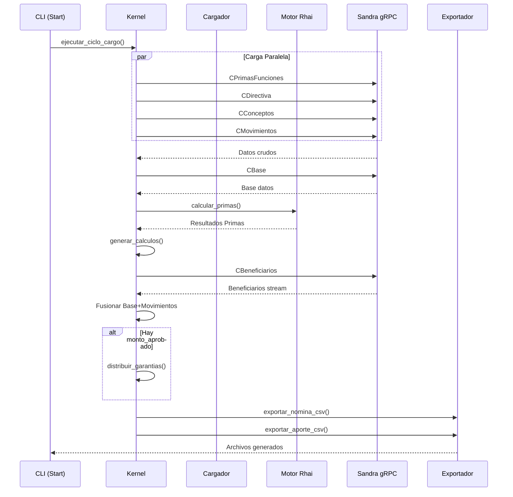

# Sandra Sentinel

**Sandra Sentinel** es un núcleo de procesamiento de alto rendimiento desarrollado en **Rust**, diseñado para la auditoría, fusión computacional y proyección de nóminas masivas en entornos jerárquicos complejos.

Actúa como un **auditor determinista**: consume datos crudos de fuentes legadas, aplica reglas de negocio modernas y genera una estructura de datos unificada y validada.

---

## Arquitectura

Sentinel está diseñado bajo principios de _Zero-Cost Abstractions_ y seguridad de memoria (_Memory Safety_), operando bajo un patrón de **Arquitectura Hexagonal (Ports & Adapters)**. El núcleo lógico (`core`) está totalmente desacoplado de las interfaces de entrada (gRPC Streams) y salida (CLI/CSV).

### Stack Tecnológico

- **Lenguaje:** Rust (Edición 2021) sobre el runtime asíncrono `Tokio`.
- **Protocolo:** gRPC con Protobuf v3 para transporte de alta eficiencia.
- **Serialización:** NDJSON (Newline Delimited JSON) sobre bytes crudos para maximizar el throughput.
- **Algoritmos:** Hash-Join en memoria para fusión de entidades y Pipeline Asíncrono para concurrencia I/O.

---

## El Motor de Cálculo (Computation Engine)

El corazón de Sentinel es su **Motor de Cálculo Estocástico-Determinista**. A diferencia de los sistemas tradicionales que realizan consultas SQL complejas (JOINs costosos), Sentinel descarga los datos "crudos" y realiza la lógica de negocio en la memoria de la aplicación (`In-Memory Computing`), aprovechando la velocidad de la CPU moderna y evitando la latencia de la base de datos.

### 1. Modelo de Datos Unificado

El motor trabaja sobre tres entidades fundamentales que se fusionan para crear un "Expediente Digital Completo" (`Beneficiario`):

1.  **Entidad Base (The Blueprint):** Contiene la información estructural del afiliado: Nivel Jerárquico (`Grado`), Grupo Organizacional (`Componente`), y Tiempos de Servicio.
2.  **Entidad Financiera (Movements):** Representa el estado transaccional dinámico: cuentas bancarias, pasivos, y variaciones monetarias.
3.  **Directivas (The Ruleset):** Tablas maestras que dictan las reglas salariales vigentes (tabuladores).

### 2. Algoritmo de Fusión (In-Memory Hash Join)

Para unir estas entidades masivamente (500k+ registros) en milisegundos, Sentinel implementa una variante del algoritmo **Hash Join**:

- **Fase de Indexación (Build Phase):**
  - Se cargan las _Entidades Base_ y _Movimientos_ en memoria.
  - Se construyen tablas hash (`HashMap<Key, &Entity>`) optimizadas. La clave de búsqueda suele ser un `Pattern` (identificador compuesto) o un ID único (Cédula).
  - _Complejidad:_ O(N).

- **Fase de Sondeo (Probe Phase):**
  - El stream de _Beneficiarios_ entra al sistema.
  - Para cada beneficiario, se realiza una búsqueda O(1) en los índices para encontrar su Base y Movimientos correspondientes.
  - **Resultado:** Un objeto `Beneficiario` enriquecido con toda su historia financiera y jerárquica sin realizar una sola consulta extra a la base de datos.

### 3. Lógica de Tiempo y Jerarquía

El motor no confía en los cálculos heredados; los recalcula al vuelo.

- **Cálculo de Antigüedad:** Utiliza aritmética de fechas (`chrono`) para determinar con precisión de días el tiempo transcurrido desde el `Ingreso al Sistema` y el `Último Ascenso`.
- **Normalización de Rangos:** Convierte identificadores jerárquicos legados en un sistema de tipos estricto, permitiendo comparaciones válidas para la asignación de primas y beneficios.

---

## Ingeniería de Rendimiento (Pipeline Asíncrono)

Uno de los logros técnicos más notables de esta implementación es su capacidad para procesar **~500,000+ registros complejos en segundos**. Esto se logra mediante una arquitectura de tubería (Pipeline) que elimina los tiempos muertos.

### El Problema "Stop-and-Wait" (Superado)

En implementaciones ingenuas, el sistema haría:
`Descargar Lote -> Pausar Red -> Deserializar (CPU) -> Procesar -> Repetir`.
Esto desperdicia el 50% del tiempo esperando I/O.

### La Solución: Async Streaming & Zero-Copy Deserialization

Sentinel implementa un flujo continuo:

1.  **Transporte Optimizado (Bytes vs Structs):**
    - Se migró el protocolo gRPC de enviar estructuras complejas (`google.protobuf.Struct`) a enviar **bloques de bytes crudos (JSON/NDJSON)**.
    - Esto elimina la costosa reflexión y asignación de memoria en el servicio upstream (Golang), reduciendo la latencia de serialización drásticamente.

2.  **Parallel Parsing (Back-pressure):**
    - El hilo principal (`Main Thread`) se dedica exclusivamente a recibir paquetes de red.
    - Inmediatamente delega la deserialización y el parsing a un _pool de hilos_ (`tokio::spawn`).
    - Mientras la CPU procesa el Lote N, la tarjeta de red ya está descargando el Lote N+1.

3.  **SIMD JSON Parsing:**
    - Al usar `serde_json::from_slice`, Rust puede utilizar instrucciones vectoriales (SIMD) para escanear el buffer de bytes y mapearlo a las estructuras en memoria (`Struct Beneficiario`) a velocidades cercanas a la del ancho de banda de la memoria RAM.

---

## Módulo de Cálculos de Nómina

Sentinel implementa un motor de cálculo completo que replica y mejora la lógica del sistema PHP heredado (KCalculoLote). Este módulo calcula de forma determinista todos los componentes salariales.

### Secuencia de Cálculos

El cálculo de nómina se ejecuta en el siguiente orden para garantizar la correcta dependencia entre valores:



### Fórmulas de Cálculo

#### 1. Sueldo Mensual
```
Sueldo Mensual = Sueldo Base + Total Primas
```

#### 2. Alicuota de Aguinaldo
```
Días = 90, 105 o 120 según año de retiro
Alicuota Aguinaldo = ((Días × Sueldo Mensual) / 30) / 12
```

| Año de Retiro | Días de Aguinaldo |
|---------------|-------------------|
| < 2016 | 90 |
| 2016 (Oct-Dic) | 105 |
| >= 2017 | 120 |

#### 3. Alicuota de Vacaciones
```
Días = 40, 45 o 50 según tiempo de servicio
Alicuota Vacaciones = ((Días × Sueldo Mensual) / 30) / 12
```

| Tiempo de Servicio | Días de Vacaciones |
|--------------------|--------------------|
| 1-14 años | 40 |
| 15-24 años | 45 |
| >= 25 años | 50 |

#### 4. Sueldo Integral
```
Sueldo Integral = Sueldo Mensual + Alicuota Vacaciones + Alicuota Aguinaldo
```

#### 5. Asignación de Antigüedad
```
Asignación Antigüedad = Sueldo Integral × Tiempo de Servicio
```

#### 6. Garantías
```
Garantías = (Sueldo Integral / 30) × 15
```

#### 7. Días Adicionales
```
Factor = min(Tiempo de Servicio, 15)
Días Adicionales = ((Sueldo Mensual / 30) × 2) × Factor
```

#### 8. No Depositado en Banco
```
No Depositado = Asignación Antigüedad - Depósito Banco - Garantías - Días Adicionales
```

---

## Sistema de Distribución de Aportes (Anticipo de Garantías)

### Problema Planteado

En algunos casos, el monto total de garantías calculado excede el presupuesto disponible. Se requiere distribuir un monto aprobado proporcionalmente entre todos los beneficiarios, garantizando que la suma total de los pagos sea exactamente igual al monto aprobado.

### Algoritmo de Distribución Exacta

Sentinel implementa un algoritmo de distribución que evita errores de precisión inherentes al uso de números de punto flotante. El algoritmo garantiza que la suma de todos los pagos sea exactamente igual al monto aprobado, incluso cuando hay decimales.

#### Principios del Algoritmo

1. **Factor Global Único**: Se calcula un factor de proporción único basado en el cociente entre el monto aprobado y la suma total de garantías.

```
Factor Global = Monto Aprobado / Suma Total de Garantías
```

2. **Uso de Centavos (Enteros)**: Para evitar errores de precisión de punto flotante, todos los cálculos se realizan convirtiendo a centavos (multiplicando por 100) y trabajando con enteros (`i64`).

3. **Ajuste del Último Registro**: El último beneficiario absorbe la diferencia residual para garantizar el cuadre exacto.

#### Pseudocódigo del Algoritmo

```rust
fn distribuir_garantias(beneficiarios: &mut [Beneficiario], monto_aprobado: f64) {
    // 1. Calcular suma total de garantías
    let suma_garantias: f64 = beneficiarios.iter()
        .map(|b| b.base.garantia_original)
        .sum();

    // 2. Calcular factor global
    let factor_global = monto_aprobado / suma_garantias;

    // 3. Convertir monto aprobado a centavos
    let monto_centavos = (monto_aprobado * 100.0).round() as i64;

    // 4. Distribuir con truncamiento
    let mut acumulado: i64 = 0;
    let n = beneficiarios.len();

    for (i, ben) in beneficiarios.iter_mut().enumerate() {
        let anticipo = ben.base.garantia_original * factor_global;
        let anticipo_centavos = (anticipo * 100.0).round() as i64;

        if i < n - 1 {
            // Truncar (redondeo hacia abajo)
            ben.base.garantia_anticipo = anticipo_centavos as f64 / 100.0;
            acumulado += anticipo_centavos;
        } else {
            // Último: cuadra exacto
            let ajuste = monto_centavos - acumulado;
            ben.base.garantia_anticipo = ajuste as f64 / 100.0;
        }

        ben.base.factor_aplicado = factor_global;
    }
}
```

#### Ejemplo Numérico

**Datos:**
- Monto Aprobado: 40,000,000.00
- Garantía Total Calculada: 57,049,791.95
- Factor Global: 40,000,000 / 57,049,791.95 = **0.70114191**

**Cálculo por Beneficiario:**
| Cédula | Garantía Original | Factor | Garantía Anticipo |
|--------|------------------|--------|-------------------|
| 10002142 | 615.90 | 0.70114191 | 431.83 |
| 10002885 | 611.71 | 0.70114191 | 429.02 |
| ... | ... | ... | ... |
| **TOTAL** | **57,049,791.95** | | **40,000,000.00** |

---

## Diagramas de Arquitectura

### Flujo Principal de Ejecución



### Pipeline de Procesamiento



---

## Ejecución Controlada (Manifiesto de Carga)

Para auditorías, pruebas específicas o ejecuciones de producción controladas, Sentinel soporta un **Manifiesto de Ejecución** en formato JSON.

### Estructura del Manifiesto

```json
{
  "nombre": "Nómina Enero 2026 - Oficial",
  "ciclo": "2026-01",
  "descripcion": "Ejecución final con ajustes de decreto.",
  "autor": "Admin. Sistemas",
  "fecha": "2026-01-31 08:00:00",
  "version": "1.0.0",
  "aportes": {
    "habilitar": true,
    "monto_aprobado_garantias": 40000000.00
  },
  "cargas": {
    "CPrimasFunciones": {
      "sql_filter": "f.oidd = 81"
    },
    "CDirectiva": {
      "sql_filter": "dd.directiva_sueldo_id = 81"
    },
    "CConceptos": {
      "sql_filter": "directiva_sueldo_id = 81"
    },
    "CBase": {
      "sql_filter": "status_id = 201"
    },
    "CBeneficiarios": {
      "sql_filter": "bnf.status_id = 201"
    }
  }
}
```

### Ejecución

```bash
cargo run -- -x -m nomina_2026.json
```

---

## Instalación

### Homebrew (macOS/Linux)

```bash
brew tap code-epic/sandra https://github.com/code-epic/homebrew-sandra
brew install code-epic/sandra/sandra-sentinel
```

### Binarios Pre-compilados

| Plataforma | Descargar |
|------------|-----------|
| macOS ARM64 | [sandra-sentinel-aarch64-apple-darwin](https://github.com/code-epic/sandra.sentinel/releases/latest) |
| macOS Intel | [sandra-sentinel-x86_64-apple-darwin](https://github.com/code-epic/sandra.sentinel/releases/latest) |
| Linux (RHEL/CentOS) | [sandra-sentinel-x86_64-unknown-linux-gnu](https://github.com/code-epic/sandra.sentinel/releases/latest) |

```bash
# Linux/macOS
curl -L https://github.com/code-epic/sandra.sentinel/releases/latest/download/sandra-sentinel-x86_64-unknown-linux-gnu -o sandra-sentinel
chmod +x sandra-sentinel
```

### Compilar desde Código

```bash
cargo build --release --package sandra_sentinel
./target/release/sandra-sentinel --version
```

---

## Release Guide

Ver [RELEASE.md](docs/RELEASE.md) para instrucciones de cómo crear releases y gestionar el workflow de GitHub Actions.

---

> **Sandra Sentinel** es un ejemplo de ingeniería de sistemas moderna: tipado fuerte, concurrencia segura y optimización a bajo nivel para resolver problemas de gestión de datos a gran escala.
