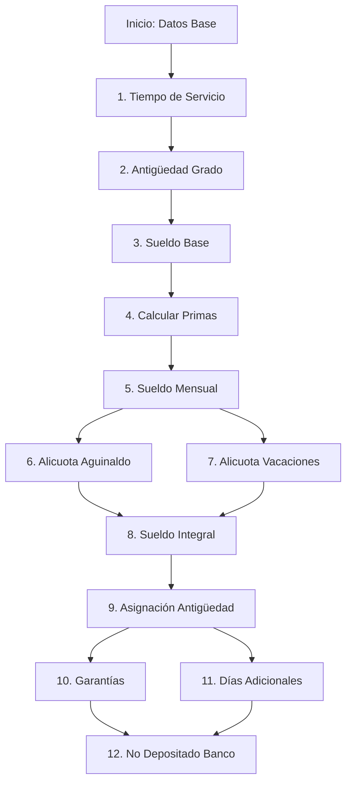
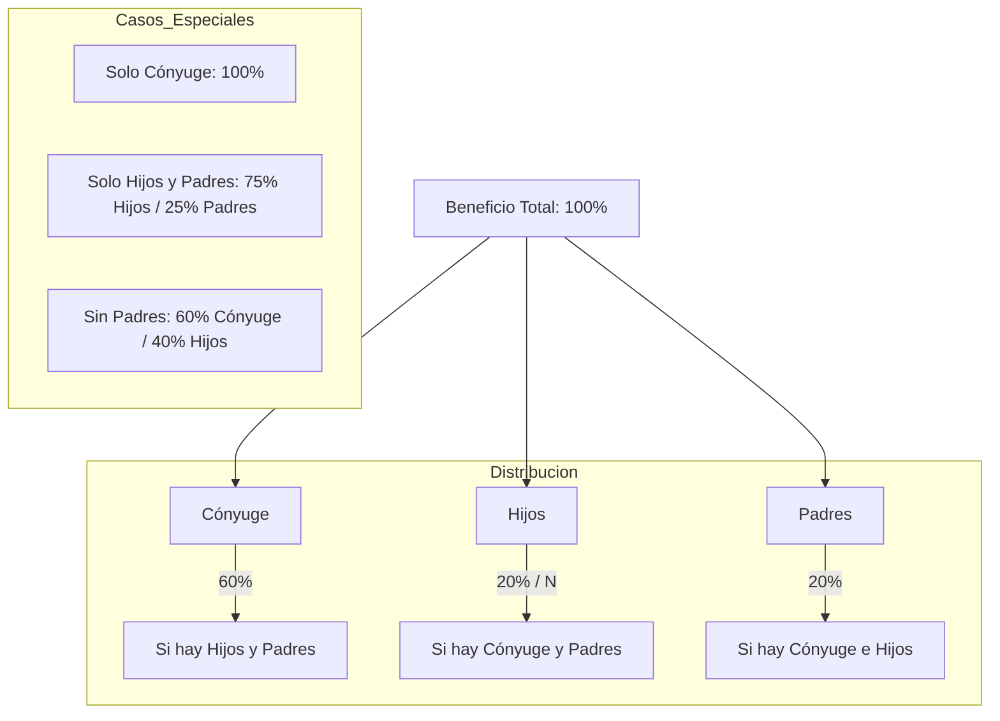
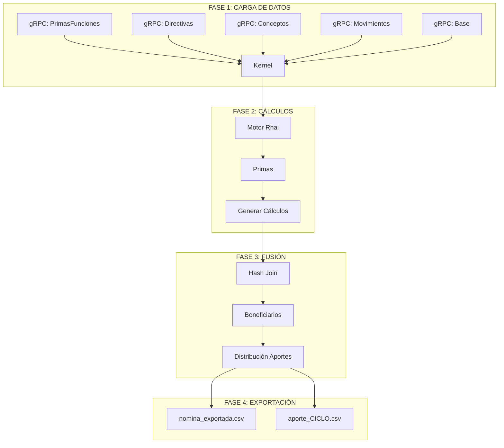
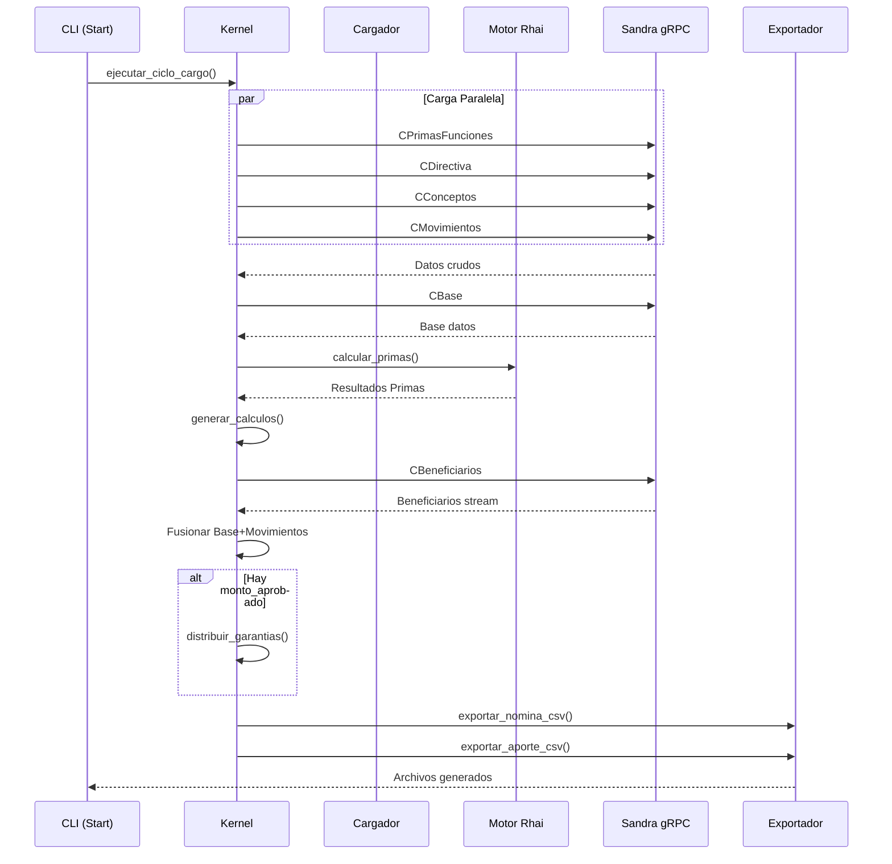

# Sandra Sentinel

**Sandra Sentinel** es un núcleo de procesamiento de alto rendimiento desarrollado en **Rust**, diseñado para la auditoría, fusión computacional y proyección de nóminas masivas en entornos jerárquicos complejos.

Actúa como un **auditor determinista**: consume datos crudos de fuentes legadas, aplica reglas de negocio modernas y genera una estructura de datos unificada y validada.

---

## Arquitectura

Sentinel está diseñado bajo principios de _Zero-Cost Abstractions_ y seguridad de memoria (_Memory Safety_), operando bajo un patrón de **Arquitectura Hexagonal (Ports & Adapters)**. El núcleo lógico (`core`) está totalmente desacoplado de las interfaces de entrada (gRPC Streams) y salida (CLI/CSV).

### Stack Tecnológico

- **Lenguaje:** Rust (Edición 2021) sobre el runtime asíncrono `Tokio`.
- **Protocolo:** gRPC con Protobuf v3 para transporte de alta eficiencia.
- **Serialización:** NDJSON (Newline Delimited JSON) sobre bytes crudos para maximizar el throughput.
- **Algoritmos:** Hash-Join en memoria para fusión de entidades y Pipeline Asíncrono para concurrencia I/O.

---

## Estructura del Proyecto (Repository Map)

El repositorio está organizado como un Workspace de Rust, separando la lógica de negocio de la interfaz de usuario:

### 📂 [core](file:///Users/crash/dev/rust/sandra.sentinel/core) — El Corazón del Sistema
Contiene la librería principal donde reside toda la lógica determinista:
- **`kernel/`**: Orquestador principal (Perceptrón) que gestiona flujos gRPC y memoria.
- **`calc/`**: Motor de fórmulas para cálculos financieros y de antigüedad.
- **`model/`**: Definiciones de estructuras (`Beneficiario`, `Grado`, `Componente`).
- **`nomina/`**: Lógica de segregación para diferentes tipos de nómina (RCP, FCP).
- **`system/`**: Configuración global y gestión de recursos del sistema.

### 📂 [cli](file:///Users/crash/dev/rust/sandra.sentinel/cli) — Interfaz de Línea de Comandos
Binario ejecutable que permite a los operadores interactuar con el Core:
- **`commands/`**: Implementación de comandos (`start`, `conciliate`, `validar`).
- **`main.rs`**: Definición de la interfaz usando `clap`.

### 📂 [schema](file:///Users/crash/dev/rust/sandra.sentinel/schema) — Documentación y Definiciones
Recursos externos para validación y configuración:
- **`README.md`**: Guía detallada de esquemas de datos y leyes.
- **`config.json`**: Estructuras de salida para CSV y TXT.
- **`manifest_*.json`**: Ejemplos de manifiestos de ejecución para diferentes escenarios.

---

## Glosario y Terminología (Ley Negro Primero)

Para comprender la lógica de Sentinel, es fundamental manejar los términos definidos en la **Ley Orgánica de Seguridad Social de la FANB**:

| Término | Definición Técnica en Sentinel |
| :--- | :--- |
| **RCP** | **Retirados con Pensión**: Personal en reserva activa con derecho a pensión directa. |
| **FCP** | **Fallecidos con Pensión (Sobrevivientes)**: Familiares que reciben pensión por derecho derivado. |
| **Causahabiente** | El militar fallecido que genera el derecho a pensión para sus familiares. |
| **Pensión de Gracia (PG)** | Beneficio especial otorgado por el Ejecutivo Nacional. |
| **Sueldo Integral** | Base de cálculo que suma: Sueldo Básico + Primas + Bonos Mensuales. |
| **Derecho de Acrecer** | Redistribución automática del porcentaje de pensión cuando un sobreviviente pierde el derecho. |

---


---

## El Motor de Cálculo (Computation Engine)

El corazón de Sentinel es su **Motor de Cálculo Estocástico-Determinista**. A diferencia de los sistemas tradicionales que realizan consultas SQL complejas (JOINs costosos), Sentinel descarga los datos "crudos" y realiza la lógica de negocio en la memoria de la aplicación (`In-Memory Computing`), aprovechando la velocidad de la CPU moderna y evitando la latencia de la base de datos.

### 1. Modelo de Datos Unificado

El motor trabaja sobre tres entidades fundamentales que se fusionan para crear un "Expediente Digital Completo" (`Beneficiario`):

1.  **Entidad Base (The Blueprint):** Contiene la información estructural del afiliado: Nivel Jerárquico (`Grado`), Grupo Organizacional (`Componente`), y Tiempos de Servicio.
2.  **Entidad Financiera (Movements):** Representa el estado transaccional dinámico: cuentas bancarias, pasivos, y variaciones monetarias.
3.  **Directivas (The Ruleset):** Tablas maestras que dictan las reglas salariales vigentes (tabuladores).

### 2. Algoritmo de Fusión (In-Memory Hash Join)

Para unir estas entidades masivamente (500k+ registros) en milisegundos, Sentinel implementa una variante del algoritmo **Hash Join**:

- **Fase de Indexación (Build Phase):**
  - Se cargan las _Entidades Base_ y _Movimientos_ en memoria.
  - Se construyen tablas hash (`HashMap<Key, &Entity>`) optimizadas. La clave de búsqueda suele ser un `Pattern` (identificador compuesto) o un ID único (Cédula).
  - _Complejidad:_ O(N).

- **Fase de Sondeo (Probe Phase):**
  - El stream de _Beneficiarios_ entra al sistema.
  - Para cada beneficiario, se realiza una búsqueda O(1) en los índices para encontrar su Base y Movimientos correspondientes.
  - **Resultado:** Un objeto `Beneficiario` enriquecido con toda su historia financiera y jerárquica sin realizar una sola consulta extra a la base de datos.

### 3. Lógica de Tiempo y Jerarquía

El motor no confía en los cálculos heredados; los recalcula al vuelo.

- **Cálculo de Antigüedad:** Utiliza aritmética de fechas (`chrono`) para determinar con precisión de días el tiempo transcurrido desde el `Ingreso al Sistema` y el `Último Ascenso`.
- **Normalización de Rangos:** Convierte identificadores jerárquicos legados en un sistema de tipos estricto, permitiendo comparaciones válidas para la asignación de primas y beneficios.

---

## Ingeniería de Rendimiento (Pipeline Asíncrono)

Uno de los logros técnicos más notables de esta implementación es su capacidad para procesar **~500,000+ registros complejos en segundos**. Esto se logra mediante una arquitectura de tubería (Pipeline) que elimina los tiempos muertos.

### El Problema "Stop-and-Wait" (Superado)

En implementaciones ingenuas, el sistema haría:
`Descargar Lote -> Pausar Red -> Deserializar (CPU) -> Procesar -> Repetir`.
Esto desperdicia el 50% del tiempo esperando I/O.

### La Solución: Async Streaming & Zero-Copy Deserialization

Sentinel implementa un flujo continuo:

1.  **Transporte Optimizado (Bytes vs Structs):**
    - Se migró el protocolo gRPC de enviar estructuras complejas (`google.protobuf.Struct`) a enviar **bloques de bytes crudos (JSON/NDJSON)**.
    - Esto elimina la costosa reflexión y asignación de memoria en el servicio upstream (Golang), reduciendo la latencia de serialización drásticamente.

2.  **Parallel Parsing (Back-pressure):**
    - El hilo principal (`Main Thread`) se dedica exclusivamente a recibir paquetes de red.
    - Inmediatamente delega la deserialización y el parsing a un _pool de hilos_ (`tokio::spawn`).
    - Mientras la CPU procesa el Lote N, la tarjeta de red ya está descargando el Lote N+1.

3.  **SIMD JSON Parsing:**
    - Al usar `serde_json::from_slice`, Rust puede utilizar instrucciones vectoriales (SIMD) para escanear el buffer de bytes y mapearlo a las estructuras en memoria (`Struct Beneficiario`) a velocidades cercanas a la del ancho de banda de la memoria RAM.

---

## Motor de Cálculo Dinámico (Rhai Runtime)

Sentinel utiliza **Rhai**, un lenguaje de scripting embebido para Rust, para ejecutar fórmulas de nómina que pueden cambiar sin necesidad de recompilar el binario principal.

### Ciclo de Vida de una Fórmula
1.  **Compilación AST (Abstract Syntax Tree)**: Al inicio, Sentinel carga todas las fórmulas desde el servidor Sandra y las compila en un AST optimizado. Esto elimina la latencia de interpretación durante el procesamiento masivo.
2.  **Inyección de Scope Dinámica**: Para cada beneficiario, se crea un `Scope` de Rhai donde se inyectan las variables del militar (ej: `sueldo_base`, `antiguedad`, `numero_hijos`) como tipos nativos de Rust mapeados a tipos de script.
3.  **Ejecución Paralela con Rayon**: El motor procesa los lotes de beneficiarios utilizando un iterador paralelo (`par_iter`), distribuyendo la carga de cálculo entre todos los núcleos disponibles de la CPU.

### Mecanismo de Tolerancia a Fallos (Circuit Breaker)
Para evitar que una fórmula mal escrita (ej: división por cero o error de sintaxis en tiempo de ejecución) detenga el procesamiento de 500k registros, Sentinel implementa un **Interruptor Automático**:
- Si una fórmula falla, el sistema captura el error (`catch_unwind` a nivel lógico).
- Utiliza una bandera atómica (`AtomicBool`) compartida entre hilos para **desactivar globalmente** esa fórmula específica para el resto de la ejecución.
- El error se registra en el log central (`sandra_sentinel.log`) con el contexto completo del beneficiario que causó el fallo.

---


---

## Módulo de Cálculos de Nómina

Sentinel implementa un motor de cálculo completo que replica y mejora la lógica del sistema PHP heredado (KCalculoLote). Este módulo calcula de forma determinista todos los componentes salariales.

### Secuencia de Cálculos

El cálculo de nómina se ejecuta en el siguiente orden para garantizar la correcta dependencia entre valores:



### Fórmulas de Cálculo

#### 1. Sueldo Mensual
```
Sueldo Mensual = Sueldo Base + Total Primas
```

#### 2. Alicuota de Aguinaldo
```
Días = 90, 105 o 120 según año de retiro
Alicuota Aguinaldo = ((Días × Sueldo Mensual) / 30) / 12
```

| Año de Retiro | Días de Aguinaldo |
|---------------|-------------------|
| < 2016 | 90 |
| 2016 (Oct-Dic) | 105 |
| >= 2017 | 120 |

#### 3. Alicuota de Vacaciones
```
Días = 40, 45 o 50 según tiempo de servicio
Alicuota Vacaciones = ((Días × Sueldo Mensual) / 30) / 12
```

| Tiempo de Servicio | Días de Vacaciones |
|--------------------|--------------------|
| 1-14 años | 40 |
| 15-24 años | 45 |
| >= 25 años | 50 |

#### 4. Sueldo Integral
```
Sueldo Integral = Sueldo Mensual + Alicuota Vacaciones + Alicuota Aguinaldo
```

#### 5. Asignación de Antigüedad
```
Asignación Antigüedad = Sueldo Integral × Tiempo de Servicio
```

#### 6. Garantías
```
Garantías = (Sueldo Integral / 30) × 15
```

#### 7. Días Adicionales
```
Factor = min(Tiempo de Servicio, 15)
Días Adicionales = ((Sueldo Mensual / 30) × 2) × Factor
```

#### 8. No Depositado en Banco
```
No Depositado = Asignación Antigüedad - Depósito Banco - Garantías - Días Adicionales
```

---

## Lógica Avanzada: Reserva Activa y Sobrevivientes

Sentinel implementa las reglas de la **Ley Negro Primero (2015)** con precisión de centavos, eliminando la ambigüedad de los sistemas legados.

### 1. Porcentajes de Pensión (RCP - Art. 38)

El porcentaje del sueldo integral que recibe un pensionado de reserva activa se calcula dinámicamente según sus años de servicio:

| Años de Servicio | % Base | Incremento Anual | Lógica de Cálculo |
| :--- | :--- | :--- | :--- |
| **15** | 50% | - | Valor base inicial |
| **16 - 18** | 50% | +2% | `50 + (años - 15) * 2` |
| **19** | 59% | - | Valor fijo |
| **20 - 22** | 59% | +3% | `59 + (años - 19) * 3` |
| **23** | 72% | - | Valor fijo |
| **24 - 26** | 72% | +4% | `72 + (años - 23) * 4` |
| **27 - 29** | 84% | +5% | `84 + (años - 27) * 5` |
| **30** | 100% | - | Pensión Completa |

### 2. Distribución de Sobrevivientes (FCP - Art. 43)

Cuando un pensionado o militar en activo fallece, Sentinel calcula la distribución porcentual para sus familiares (`Causahabientes`) aplicando las reglas de prelación:



> [!IMPORTANT]
> **Derecho de Acrecer**: Si un hijo cumple la mayoría de edad (18 años, o 26 si estudia), su porcentaje se redistribuye automáticamente entre los sobrevivientes restantes según dicta la ley.

---

---

## Sistema de Distribución de Aportes (Anticipo de Garantías)

### Problema Planteado

En algunos casos, el monto total de garantías calculado excede el presupuesto disponible. Se requiere distribuir un monto aprobado proporcionalmente entre todos los beneficiarios, garantizando que la suma total de los pagos sea exactamente igual al monto aprobado.

### Algoritmo de Distribución Exacta

Sentinel implementa un algoritmo de distribución que evita errores de precisión inherentes al uso de números de punto flotante. El algoritmo garantiza que la suma de todos los pagos sea exactamente igual al monto aprobado, incluso cuando hay decimales.

#### Principios del Algoritmo

1. **Factor Global Único**: Se calcula un factor de proporción único basado en el cociente entre el monto aprobado y la suma total de garantías.

```
Factor Global = Monto Aprobado / Suma Total de Garantías
```

2. **Uso de Centavos (Enteros)**: Para evitar errores de precisión de punto flotante, todos los cálculos se realizan convirtiendo a centavos (multiplicando por 100) y trabajando con enteros (`i64`).

3. **Ajuste del Último Registro**: El último beneficiario absorbe la diferencia residual para garantizar el cuadre exacto.

#### Pseudocódigo del Algoritmo

```rust
fn distribuir_garantias(beneficiarios: &mut [Beneficiario], monto_aprobado: f64) {
    // 1. Calcular suma total de garantías
    let suma_garantias: f64 = beneficiarios.iter()
        .map(|b| b.base.garantia_original)
        .sum();

    // 2. Calcular factor global
    let factor_global = monto_aprobado / suma_garantias;

    // 3. Convertir monto aprobado a centavos
    let monto_centavos = (monto_aprobado * 100.0).round() as i64;

    // 4. Distribuir con truncamiento
    let mut acumulado: i64 = 0;
    let n = beneficiarios.len();

    for (i, ben) in beneficiarios.iter_mut().enumerate() {
        let anticipo = ben.base.garantia_original * factor_global;
        let anticipo_centavos = (anticipo * 100.0).round() as i64;

        if i < n - 1 {
            // Truncar (redondeo hacia abajo)
            ben.base.garantia_anticipo = anticipo_centavos as f64 / 100.0;
            acumulado += anticipo_centavos;
        } else {
            // Último: cuadra exacto
            let ajuste = monto_centavos - acumulado;
            ben.base.garantia_anticipo = ajuste as f64 / 100.0;
        }

        ben.base.factor_aplicado = factor_global;
    }
}
```

#### Ejemplo Numérico

**Datos:**
- Monto Aprobado: 40,000,000.00
- Garantía Total Calculada: 57,049,791.95
- Factor Global: 40,000,000 / 57,049,791.95 = **0.70114191**

**Cálculo por Beneficiario:**
| Cédula | Garantía Original | Factor | Garantía Anticipo |
|--------|------------------|--------|-------------------|
| 10002142 | 615.90 | 0.70114191 | 431.83 |
| 10002885 | 611.71 | 0.70114191 | 429.02 |
| ... | ... | ... | ... |
| **TOTAL** | **57,049,791.95** | | **40,000,000.00** |

---

## Subsistema Bancario y Formatos de Transferencia

Sentinel incluye un adaptador especializado para la comunicación con instituciones financieras, capaz de transformar los resultados de nómina en archivos de ancho fijo (TXT) altamente estructurados.

### Entidades Bancarias Soportadas
Sentinel implementa la lógica específica de empaquetado para:
- **Banco de Venezuela (Plan 03487)**: Formatos de 180+ caracteres con padding específico.
- **Banfanb**: Estructuras militares de pago.
- **Bicentenario**: Formatos gubernamentales de nómina social.

### Lógica de Padding y Alineación
Para cumplir con los estándares bancarios legacy, el sistema utiliza funciones internas de tipado estricto:
- `pad_left(input, len, '0')`: Para montos y cédulas (rellenado con ceros a la izquierda).
- `pad_right(input, len, ' ')`: Para nombres y descripciones (rellenado con espacios a la derecha).

### Modos de Generación
El sistema soporta cuatro tipos de archivos (`TipoArchivo`) configurables desde el manifiesto:
1.  **Apertura**: Para creación masiva de cuentas bancarias de nuevos pensionados.
2.  **Aporte**: Para depósitos mensuales regulares de nómina.   
3.  **Retiro**: Para liquidaciones y pagos únicos.
4.  **Mixto**: Detecta automáticamente si el monto es positivo (Aporte) o negativo (Retiro).

---

## Generación Automática de Apertura y Aporte

A partir de la versión 1.1.0, Sentinel implementa un sistema de división automática que permite procesar nóminas donde no todos los beneficiarios tienen movimientos en el período. Esta funcionalidad es útil cuando la cantidad de beneficiarios registrados excede la cantidad de movimientos en el ciclo.

### Lógica de División

El sistema evalúa cada beneficiario según sus movimientos:

```rust
let m = &b.movimientos;
let total_mov = m.cap_banco + m.anticipo + m.dep_adicional + m.dep_garantia + m.anticipor;

if total_mov > 0.0 {
    // tiene movimientos → Aporte
} else {
    // sin movimientos → Apertura
}
```

### Escenario de Uso

| Entidad | Cantidad | Descripción |
|--------|----------|-------------|
| Beneficiarios | 113,422 | Total pensionados activos |
| Movimientos | 87,626 | Registros de saldo en ciclo |
| Diferencia | 25,796 | Sin movimientos → Apertura |

### Configuración del Manifiesto

```json
{
  "nombre": "Nómina Enero 2026",
  "ciclo": "2026-01",
  "aportes": {
    "habilitar": true,
    "monto_aprobado_garantias": 40000000.00,
    "generar_apertura_con_aporte": true
  },
  "salida": {
    "destino": "./nm",
    "compresion": true,
    "nivel_compresion": 3
  }
}
```

### Archivos Generados

| Archivo | Contenido | Formato |
|---------|----------|--------|
| `aporte_2026-01.csv.zst` | Beneficiarios con movimientos | CSV comprimido |
| `APERT2026-01.txt.zst` | Beneficiarios sin movimientos | TXT banco |

### Ejemplo de Ejecución

```bash
cargo run -p sandra_sentinel -- start -x --log --sensors --tipo npr -m manifest.json
```

**Salida esperada:**
```
EXPORTANDO APORTE Y APERTURA CONJUNTOS
    > Dividiendo beneficiarios: 87626 aporte, 25796 apertura
  Exportación Aporte        :         OK (aporte_2026-01.csv.zst)
  Exportación Apertura      :         OK (APERT2026-01.txt.zst)
```

---

## Auditoría y Conciliación (Framework SCF)

El sistema incluye el módulo **SCF (Financial Control Framework)**, diseñado para conciliar la "verdad del sistema" contra la "verdad del banco".

### El Algoritmo de Conciliación Masiva
1.  **Normalización de Fuentes**: Transforma archivos externos (ej. estados de cuenta en CSV/Excel) a una estructura interna común.
2.  **Key Generator**: Crea una clave única compuesta (Cédula + Monto + Referencia) para identificar duplicados o pagos faltantes.
3.  **Comparator Engine**: Compara dos flujos masivos de datos en O(N log N) para detectar:
    *   **Hallazgos Positivos**: Pagos procesados correctamente.
    *   **Discrepancias**: Montos que no coinciden con la nómina original.
    *   **Faltantes**: Registros en el sistema que no se reflejan en el banco.

---

---

## Diagramas de Arquitectura

### Flujo Principal de Ejecución



### Pipeline de Procesamiento



---

## Interoperabilidad gRPC (Sandra Server)

Sentinel no almacena datos; es un motor de paso que consume flujos binarios. La comunicación con el servidor central se basa en **gRPC de baja latencia**:

- **Stream Inbound**: Los datos se reciben como `Stream<Item = RawBytes>` para evitar el overhead de deserialización en el servidor.
- **Protocol Buffers**: Se utilizan definiciones compartidas para garantizar que los tipos de datos (Cédula, Montos, Fechas) sean consistentes entre el backend en Go y el core en Rust.
- **Back-pressure**: El sistema maneja el flujo de datos dinámicamente; si el motor de cálculo está saturado, el receptor gRPC reduce la velocidad de petición automáticamente.

---

## Seguridad y Auditoría

Como sistema de manejo de fondos públicos, Sentinel prioriza la trazabilidad:

1. **Inmutabilidad**: Una vez que un registro entra al pipeline, no puede ser modificado manualmente; solo se permiten ajustes a través de nuevas directivas aplicadas por el motor.
2. **Firmas de Cálculo**: Cada exportación genera un hash único basado en los parámetros del manifiesto, asegurando que los resultados no hayan sido alterados post-proceso.
3. **Validación de Roles**: El comando `validar` utiliza criptografía para asegurar que solo personal autorizado pueda iniciar ciclos de nómina de producción.

---

## Integridad y Compresión de Datos (Sello SHA-256)

Para proteger la integridad de los fondos públicos, Sentinel implementa una capa de seguridad criptográfica en cada exportación.

### 1. Sellado SHA-256 Sideloading
Cada vez que se genera un archivo de nómina o bancario, Sentinel calcula su hash SHA-256 en tiempo real. Este hash se incluye en el reporte de salida y se registra en la bitácora de auditoría. Si un archivo es modificado accidental o maliciosamente (ej: cambio de un monto en el CSV), el hash no coincidirá, invalidando la carga bancaria.

### 2. Compresión Industrial con Zstd
Sentinel utiliza el algoritmo **Zstandard (Zstd)** de Facebook para comprimir los resultados masivos.
- **Rendimiento**: Zstd ofrece un balance superior entre velocidad de compresión y ratio de reducción comparado con Gzip.
- **Escalabilidad**: Un archivo de 500MB de nómina se reduce típicamente a ~30MB en milisegundos, facilitando la transferencia segura a través de redes IPSFA restringidas.

---

---

Para auditorías, pruebas específicas o ejecuciones de producción controladas, Sentinel soporta un **Manifiesto de Ejecución** en formato JSON.

### 1. Referencia Técnica de Campos

El archivo JSON se divide en cuatro bloques principales de configuración:

#### A. Bloque General de Meta-datos
| Campo | Tipo | Descripción |
| :--- | :--- | :--- |
| `nombre` | String | Identificador descriptivo de la ejecución. |
| `ciclo` | String | Periodo de nómina (ej: `2026-01`). |
| `parametros_globales` | Map | Variables adicionales accesibles en todo el pipeline. |

#### B. Configuración de Cargas (`cargas`)
Cada entrada en este mapa define una fuente de datos gRPC:
- **`api_name`**: Nombre del endpoint en el servidor Sandra (ej: `IPSFA_CBase`).
- **`sql_filter`**: Filtro SQL (WHERE) aplicado en el servidor para reducir el stream.
- **`limit`**: (Opcional) Número máximo de registros a procesar.
- **`parametros_extra`**: (Opcional) Filtros JSON complejos para la API.

#### C. Configuración de Aportes (`aportes`)
Gestiona la distribución de montos aprobados:
- **`habilitar`**: Boolean para activar el algoritmo de repartición proporcional.
- **`monto_aprobado_garantias`**: Monto total Bs. a distribuir entre los beneficiarios.
- **`generar_apertura_con_aporte`** (v1.1.0+): Boolean para generar automáticamente archivo de apertura para beneficiarios sin movimientos.

#### D. Configuración de Salida (`salida`)
- **`destino`**: Carpeta donde se generarán los CSV/NDJSON.
- **`compresion`**: Boolean para habilitar Gzip.
- **`format_txt`**: Tipo de archivo bancario (`apertura`, `aporte`, `retiro`, `mixto`).
- **`bancos`**: Array de códigos bancarios (ej: `["0102", "0177"]`) para filtrar la exportación.

---

### 2. Variaciones del Manifiesto

A continuación se presentan las configuraciones estándar para los escenarios más comunes:

````carousel
```json
// --- VARIACIÓN 1: Nómina RCP (Retirados) ---
{
  "nombre": "Nómina NRCP - Retirados con Pensión",
  "ciclo": "2026-01",
  "cargas": {
    "CBase": { "sql_filter": "bnf.situacion = 'RCP'" },
    "CBeneficiarios": { "sql_filter": "bnf.situacion = 'RCP'" }
  },
  "salida": {
    "destino": "./output/rcp",
    "compresion": false,
    "bancos": ["0102", "0177"]
  }
}
```
<!-- slide -->
```json
// --- VARIACIÓN 2: Nómina FCP (Sobrevivientes) ---
{
  "nombre": "Nómina NFCP - Fallecidos con Pensión",
  "ciclo": "2026-01",
  "cargas": {
    "CBase": { "sql_filter": "status_id = 401" },
    "FAMILIARES": { 
      "api_name": "public.familiar",
      "sql_filter": "porcentaje > 0" 
    }
  },
  "salida": {
    "destino": "./output/fcp",
    "format_txt": "retiro"
  }
}
```
<!-- slide -->
```json
// --- VARIACIÓN 3: Con Distribución de Aportes ---
{
  "nombre": "Ajuste de Garantías - Enero 2026",
  "ciclo": "2026-01",
  "aportes": {
    "habilitar": true,
    "monto_aprobado_garantias": 40000000.00
  },
  "salida": {
    "format_txt": "aporte"
  }
}
```
````

### Ejecución
```bash
# Ejecución estándar con manifiesto
cargo run --package sandra-cli -- start -x -m nomina_2026.json

# Ejecución con métricas de rendimiento (Sensores)
cargo run --package sandra-cli -- start -x -s --log
```

---

## Manual de Referencia CLI

El binario `sandra` es la interfaz principal para operar el sistema.

### 1. `start` — Iniciar Proceso de Nómina
Es el comando principal que orquesta la carga, cálculo y exportación.

| Opción | Corta | Descripción |
| :--- | :--- | :--- |
| `--execute` | `-x` | Inicia el ciclo inmediatamente. |
| `--manifest` | `-m` | Ruta al archivo JSON de manifiesto. |
| `--sensors` | `-s` | Habilita métricas de CPU/Memoria y tiempo de ejecución. |
| `--log` | | Guarda eventos detallados en `sandra_sentinel.log`. |
| `--tipo` | `-t` | Especifica el tipo de nómina (`npr`, `nact`, `nrcp`, `nfcp`). |
| `--debug` | `-d` | Muestra trazas técnicas de gRPC y memoria. |

### 2. `conciliate` — Auditoría de Archivos
Compara dos fuentes de datos (ej. Banco vs Sistema) para detectar discrepancias financieras.

```bash
sandra conciliate --comparison banco.csv --origin sistema.csv --origin-columns 0,1,3
```

### 3. `validar` — Herramienta de Seguridad
Permite verificar tokens de acceso y permisos de administración del sistema.

---

## Guía de Desarrollo y Contribución

### Requisitos del Entorno
- **Rust Stable** (1.75+ recomendado).
- **Protobuf Compiler** (`protoc`) para compilación de definiciones gRPC.
- **Acceso a Sandra Server** (Upstream) o mock configurado.

### Flujo de Compilación
```bash
# Compilar todo el workspace
cargo build

# Ejecutar tests unitarios de lógica de cálculo
cargo test -p sandra-core

# Ejecutar benchmark de rendimiento (Hash Join)
cargo bench -p sandra-core
```

### Logging y Debugging
Sentinel utiliza el sistema de registro asíncrono. Puedes ajustar el nivel de detalle mediante variables de entorno:
```bash
RUST_LOG=debug cargo run -- start
```

---

---

## Instalación

### Homebrew (macOS/Linux)

```bash
brew tap code-epic/sandra https://github.com/code-epic/homebrew-sandra
brew install code-epic/sandra/sandra-sentinel
```

### Binarios Pre-compilados

| Plataforma | Descargar |
|------------|-----------|
| macOS ARM64 | [sandra-sentinel-aarch64-apple-darwin](https://github.com/code-epic/sandra.sentinel/releases/latest) |
| macOS Intel | [sandra-sentinel-x86_64-apple-darwin](https://github.com/code-epic/sandra.sentinel/releases/latest) |
| Linux (RHEL/CentOS) | [sandra-sentinel-x86_64-unknown-linux-gnu](https://github.com/code-epic/sandra.sentinel/releases/latest) |

```bash
# Linux/macOS
curl -L https://github.com/code-epic/sandra.sentinel/releases/latest/download/sandra-sentinel-x86_64-unknown-linux-gnu -o sandra-sentinel
chmod +x sandra-sentinel
```

### Compilar desde Código

```bash
cargo build --release --package sandra_sentinel
./target/release/sandra-sentinel --version
```

---

## Release Guide

Ver [RELEASE.md](docs/RELEASE.md) para instrucciones de cómo crear releases y gestionar el workflow de GitHub Actions.

---

> **Sandra Sentinel** es un ejemplo de ingeniería de sistemas moderna: tipado fuerte, concurrencia segura y optimización a bajo nivel para resolver problemas de gestión de datos a gran escala.
