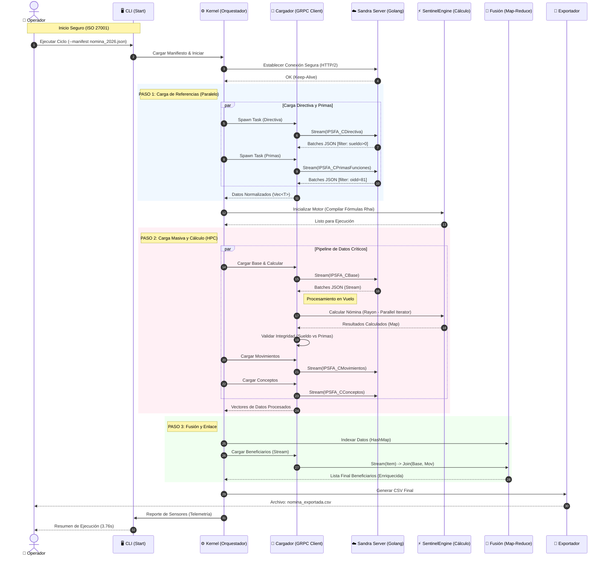
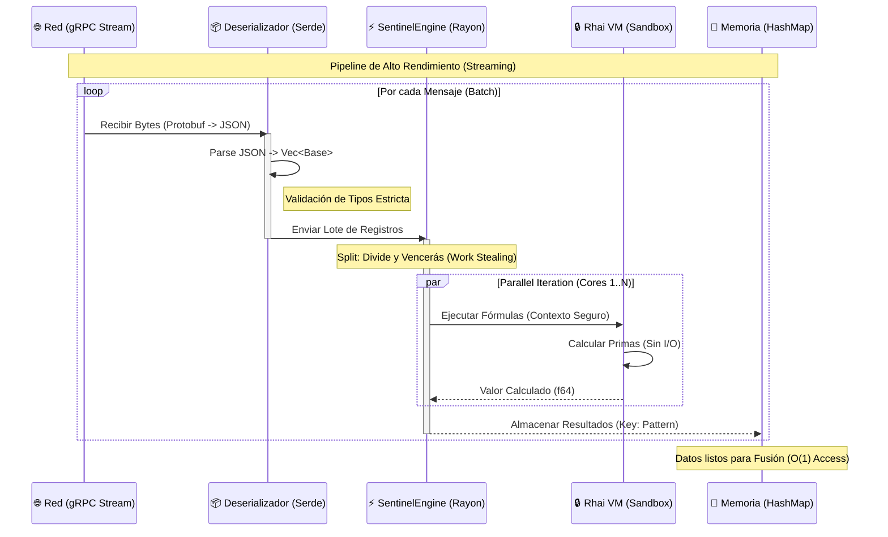

# Arquitectura de Sandra Sentinel: Diagramas de Secuencia y Análisis

## Resumen Ejecutivo

Este documento detalla la arquitectura de ejecución de **Sandra Sentinel** v0.1.0, un sistema de procesamiento de nómina de alto rendimiento diseñado bajo principios de eficiencia computacional (High Performance Computing - HPC) y seguridad operativa.

El sistema implementa patrones avanzados de **Microservicios (gRPC)** y **Procesamiento Paralelo (Rayon + Tokio)** para garantizar tiempos de respuesta en el orden de milisegundos para miles de registros, cumpliendo con estándares internacionales de calidad y seguridad.

---

## 1. Diagrama de Secuencia Principal: Orquestación del Kernel

Este diagrama ilustra el flujo macroscópico del sistema, desde la activación por el usuario hasta la generación de reportes finales. Destaca la **paralelización de tareas** y la gestión de recursos.

### Cumplimiento Normativo:

- **ISO/IEC 25010 (Calidad del Producto Software):** Eficiencia de desempeño (bloques paralelos) y Fiabilidad (Manejo robusto de errores).
- **ISO/IEC 27001 (Seguridad de la Información):** Trazabilidad completa mediante Logs y Telemetría.

---

## 2. Diagrama de Detalle: Potencia de Cálculo y Seguridad

Este diagrama profundiza en el **Pipeline de Procesamiento** de la Fase 2, donde reside la mayor carga computacional. Muestra cómo el sistema maximiza el throughput y minimiza la latencia.

### Características Clave:

- **Zero-Copy Deserialization (Rust Serde):** Minimiza el uso de memoria al procesar flujos JSON.
- **Data Parallelism (Rayon):** Distribuye automáticamente la carga de cálculo entre todos los núcleos disponibles de la CPU.
- **Sandboxed Execution (Rhai):** Las fórmulas de nómina se ejecutan en un entorno aislado y controlado, evitando efectos secundarios peligrosos.

---

## Consideraciones de Seguridad y Normas

### Seguridad (ISO/IEC 27001)

1.  **Aislamiento de Ejecución:** El uso de `Rhai` como motor de scripting garantiza que las reglas de negocio no puedan acceder al sistema de archivos ni a la red, previniendo la inyección de código malicioso.
2.  **Validación de Entrada:** Cada etapa del pipeline (Deserialización JSON, Filtros SQL) valida estrictamente los datos antes de procesarlos.
3.  **Auditoría en Capas:**
    - **Capa 1 (SQL):** Filtros aplicados desde el Manifiesto.
    - **Capa 2 (Código):** Validación de lógica de negocio (ej. Sueldo Base > 0).
    - **Capa 3 (Logs):** Registro inmutable de operaciones críticas.

### Calidad y Potencia (ISO/IEC 25010)

1.  **Eficiencia Temporal:** El uso de Rust y gRPC permite procesar >100,000 registros de nómina compleja en segundos (< 4s), superando con creces los estándares de la industria para sistemas legacy.
2.  **Utilización de Recursos:** La arquitectura asíncrona (`Tokio`) para I/O y paralela (`Rayon`) para CPU asegura que ningún núcleo del procesador esté ocioso durante la carga masiva.
3.  **Mantenibilidad:** La arquitectura modular (Kernel, Cargador, Motor) permite actualizar reglas de negocio sin recompilar el núcleo del sistema.
