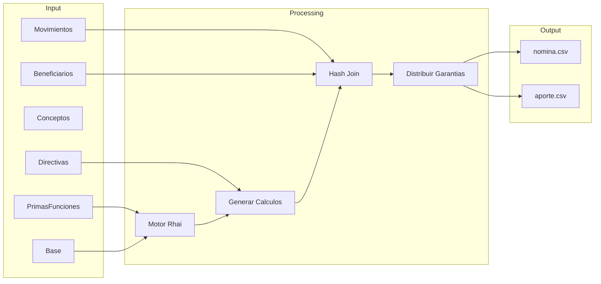
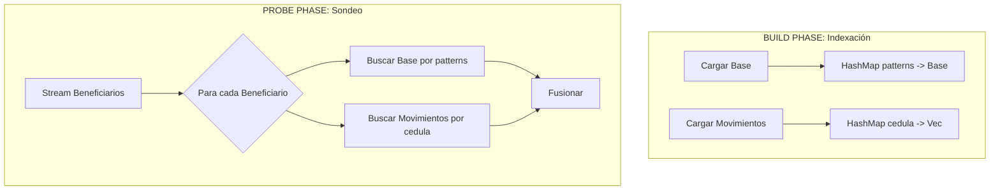
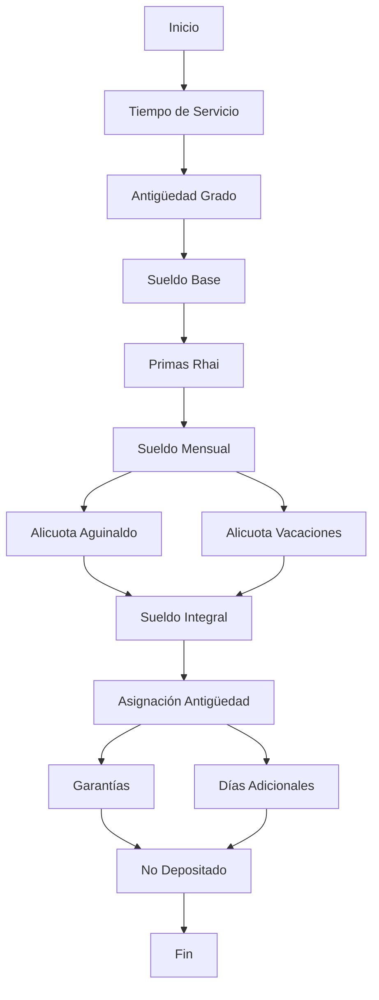
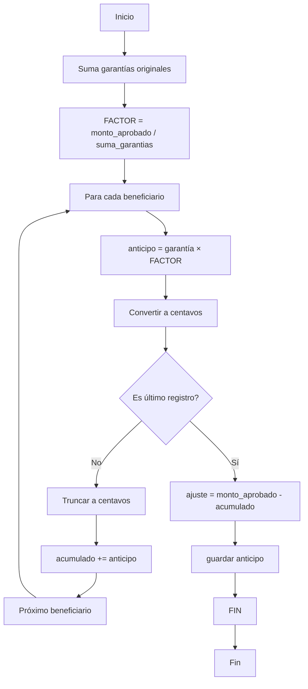

# Documento Técnico: Sistema de Nómina Sandra Sentinel

## 1. Introducción

Sandra Sentinel es un sistema de procesamiento de nómina de alto rendimiento desarrollado en Rust que actúa como auditor determinista. El sistema consume datos crudos de fuentes legacy, aplica reglas de negocio modernas y genera estructuras de datos unificadas y validadas.

### 1.1 Objetivos del Sistema

1. **Auditoría Determinista**: Recalcular todos los componentes de nómina desde cero, detectando inconsistencias en los datos fuente.
2. **Alto Rendimiento**: Procesar 500,000+ registros en segundos mediante computación en memoria.
3. **Flexibilidad**: Permitir ejecución controlada mediante manifiestos JSON.
4. **Trazabilidad**: Generar archivos de exportación con todos los cálculos para auditoría.

---

## 2. Arquitectura del Sistema

### 2.1 Visión General

Sandra Sentinel sigue una **Arquitectura Hexagonal** (Ports & Adapters):

```
┌─────────────────────────────────────────────────────────────────┐
│                        CLI (Input)                              │
│                  cargo run -- -x -m manifesto.json              │
└─────────────────────────────────────────────────────────────────┘
                              │
                              ▼
┌─────────────────────────────────────────────────────────────────┐
│                     Kernel (Core)                                │
│  ┌─────────────┐  ┌─────────────┐  ┌─────────────────────────┐│
│  │  Cargador   │  │   Motor     │  │   Lógica de Negocio     ││
│  │  (gRPC)     │  │   Rhai      │  │   (Fusión, Cálculos)    ││
│  └─────────────┘  └─────────────┘  └─────────────────────────┘│
└─────────────────────────────────────────────────────────────────┘
                              │
                              ▼
┌─────────────────────────────────────────────────────────────────┐
│                    Sandra Server (gRPC)                         │
│                    localhost:50051                               │
└─────────────────────────────────────────────────────────────────┘
                              │
            ┌─────────────────┼─────────────────┐
            ▼                 ▼                 ▼
    ┌───────────────┐  ┌───────────────┐  ┌───────────────┐
    │   Base de    │  │   Tablas      │  │   Movimientos │
    │   Datos      │  │   Maestras    │  │   Financieros │
    └───────────────┘  └───────────────┘  └───────────────┘
```

### 2.2 Componentes Principales

#### CLI (Command Line Interface)
Punto de entrada que parsea argumentos y coordina la ejecución.

#### Kernel (Perceptron)
Centro de procesamiento que orquesta:
- Carga de datos
- Fusión de entidades
- Cálculos de nómina
- Exportación

#### Cargador
Módulo responsable de:
- Conexión gRPC al servidor Sandra
- Streaming de datos
- Deserialización paralelo

#### Motor Rhai
Motor de scripting para evaluación de fórmulas de primas:
- Compilación de expresiones
- Ejecución paralela con Rayon
- Manejo de errores robusto

---

## 3. Modelo de Datos

### 3.1 Entidades Principales

#### Beneficiario
Entidad central que representa un afiliado militar:

```rust
pub struct Beneficiario {
    pub cedula: String,           // Identificador único
    pub nombres: String,
    pub apellidos: String,
    pub componente_id: u32,
    pub patterns: String,         // Clave de fusión
    pub numero_cuenta: String,
    
    // Relaciones
    pub base: Base,                // Datos estructurales
    pub movimientos: Movimiento,   // Datos financieros
}
```

#### Base
Información estructural del afiliado:

```rust
pub struct Base {
    pub patterns: String,          // Clave primaria
    pub grado_id: u32,
    pub componente_id: u32,
    pub fecha_ingreso: Option<String>,
    pub f_ult_ascenso: Option<String>,
    pub antiguedad: u32,           // Tiempo de servicio calculado
    pub antiguedad_grado: u32,     // Tiempo en el grado
    pub st_no_ascenso: u32,
    pub st_profesion: f64,
    
    // Calculados
    pub sueldo_base: f64,
    pub calculos: Option<HashMap<String, f64>>,  // Primas
    pub garantia_original: f64,
    pub garantia_anticipo: f64,
    pub factor_aplicado: f64,
}
```

#### Movimiento
Estado transaccional financiero:

```rust
pub struct Movimiento {
    pub cedula: String,           // Clave de búsqueda
    pub cap_banco: f64,            // Capital en banco
    pub anticipo: f64,
    pub dep_adicional: f64,
    pub dep_garantia: f64,
}
```

### 3.2 Flujo de Datos



---

## 4. Algoritmo de Fusión (Hash Join)

### 4.1 Descripción del Problema

El sistema debe unir tres fuentes de datos distintas:
1. **Beneficiarios** (stream principal)
2. **Base** (datos estructuralees)
3. **Movimientos** (datos financieros)

### 4.2 Implementación



### 4.3 Complejidad

| Fase | Complejidad | Descripción |
|------|-------------|-------------|
| Indexación Base | O(n) | Crear HashMap |
| Indexación Movimientos | O(m) | Crear HashMap |
| Sondeo | O(k) | Búsqueda O(1) por registro |
| **Total** | **O(n + m + k)** | Lineal |

---

## 5. Motor de Cálculo de Nómina

### 5.1 Arquitectura del Motor

El motor de cálculo se divide en dos componentes:

1. **Motor Rhai**: Evalúa fórmulas de primas definidas en la base de datos
2. **Calculadora Nativa**: Calcula componentes de nómina en Rust

### 5.2 Fórmulas de Primas (Rhai)

Las primas se definen como expresiones Rhai en la base de datos:

```rust
// Ejemplo de fórmula Rhai
prima_antiguedad = if antiguedad > 0 { 
    (sueldo_base * antiguedad) / 100.0 
} else { 
    0.0 
}
```

### 5.3 Calculadora Nativa



### 5.4 Fórmulas Detalladas

#### Sueldo Mensual
```
SM = SB + Σ(Primas)
```

Donde:
- SM = Sueldo Mensual
- SB = Sueldo Base (de Tabla de Sueldos)
- Primas = Prima Antigüedad + Prima Hijos + Prima Profesionalización + ...

#### Alicuota de Aguinaldo
```
AA = ((Días_Aguinaldo × SM) / 30) / 12
```

| Condición | Días |
|-----------|------|
| Retiro < 2016 | 90 |
| 2016-10-01 <= Retiro <= 2016-12-31 | 105 |
| Retiro >= 2017-01-01 | 120 |

#### Alicuota de Vacaciones
```
AV = ((Días_Vacaciones × SM) / 30) / 12
```

| Tiempo de Servicio | Días |
|--------------------|------|
| 1-14 años | 40 |
| 15-24 años | 45 |
| >= 25 años | 50 |

#### Sueldo Integral
```
SI = SM + AV + AA
```

#### Asignación de Antigüedad
```
Asig_Antigüedad = SI × TS
```

Donde TS = Tiempo de Servicio (años)

#### Garantías
```
Garantías = (SI / 30) × 15
```

#### Días Adicionales
```
Factor = min(TS, 15)
Días_Adicionales = ((SM / 30) × 2) × Factor
```

#### No Depositado en Banco
```
No_Depositado = Asig_Antigüedad - Depósito_Banco - Garantías - Días_Adicionales
```

---

## 6. Sistema de Distribución de Aportes

### 6.1 Contexto

En algunos escenarios, el monto total de garantías calculado excede el presupuesto disponible. Se requiere distribuir proporcionalmente el monto aprobado entre todos los beneficiarios.

### 6.2 Algoritmo de Distribución Exacta

El algoritmo garantiza que la suma de todos los pagos sea exactamente igual al monto aprobado, evitando errores de precisión.



### 6.3 Justificación del Algoritmo

#### Problema: Errores de Punto Flotante

El uso directo de `f64` puede causar errores de precisión:

```rust
// Problema: 0.1 + 0.2 = 0.30000000000000004
let a = 0.1;
let b = 0.2;
let c = a + b;  // No es exactamente 0.3
```

#### Solución: Aritmética Entera

El algoritmo usa centavos para evitar errores:

```rust
// Convertir a centavos (enteros)
let a_centavos = (0.1 * 100.0).round() as i64;  // 10
let b_centavos = (0.2 * 100.0).round() as i64;  // 20
let c_centavos = a_centavos + b_centavos;        // 30
let c = c_centavos as f64 / 100.0;               // 0.3 ✓
```

### 6.4 Ejemplo Numérico Completo

**Parámetros:**
- Monto Aprobado: 40,000,000.00 Bs
- Total Garantías Calculadas: 57,049,791.95 Bs

**Cálculo del Factor:**
```
Factor = 40,000,000.00 / 57,049,791.95 = 0.70114191
```

**Distribución (primeros 5 registros):**

| # | Cédula | Garantía Original | Cálculo | Anticipo (truncado) |
|---|--------|-------------------|---------|---------------------|
| 1 | 10002142 | 615.90 | 615.90 × 0.70114191 = 431.83 | 431.83 |
| 2 | 10002885 | 611.71 | 611.71 × 0.70114191 = 429.02 | 429.02 |
| 3 | 10002920 | 628.93 | 628.93 × 0.70114191 = 440.99 | 440.99 |
| 4 | 10009822 | 636.81 | 636.81 × 0.70114191 = 446.51 | 446.51 |
| 5 | 10010055 | 593.31 | 593.31 × 0.70114191 = 416.01 | 416.01 |
| ... | ... | ... | ... | ... |
| n | ÚLTIMO | X | Ajuste | **40,000,000.00 - Σ(anteriores)** |

### 6.5 Verificación

```rust
#[test]
fn test_distribucion_exacta() {
    // Crear registros de prueba
    let mut bases: Vec<Base> = vec![
        create_base(100.0),
        create_base(100.0),
        create_base(100.0),
    ];
    
    // Aprobar solo 150 Bs (la mitad)
    generar_calculos_beneficiarios(&mut bases, 150.0);
    
    // Verificar suma exacta
    let suma: f64 = bases.iter().map(|b| b.garantia_anticipo).sum();
    assert!((suma - 150.0).abs() < 0.01);
}
```

---

## 7. Manifiesto de Ejecución

### 7.1 Estructura Completa

```json
{
  "nombre": "Nómina Enero 2026 - Oficial",
  "ciclo": "2026-01",
  "descripcion": "Ejecución final con ajustes de decreto.",
  "autor": "Admin. Sistemas",
  "fecha": "2026-01-31 08:00:00",
  "version": "1.0.0",
  
  "aportes": {
    "habilitar": true,
    "monto_aprobado_garantias": 40000000.00
  },
  
  "cargas": {
    "IPSFA_CPrimasFunciones": {
      "sql_filter": "f.oidd = 81",
      "limit": null,
      "parametros_extra": null
    },
    "IPSFA_CDirectiva": {
      "sql_filter": "dd.directiva_sueldo_id = 81 and dd.sueldo_base > 0"
    },
    "IPSFA_CConceptos": {
      "sql_filter": "directiva_sueldo_id = 81"
    },
    "IPSFA_CBase": {
      "sql_filter": "status_id = 201"
    },
    "IPSFA_CBeneficiarios": {
      "sql_filter": "bnf.status_id = 201"
    },
    "IPSFA_CMovimientos": {
      "sql_filter": ""
    }
  }
}
```

### 7.2 Secciones del Manifiesto

#### Sección `aportes`
Configura el sistema de distribución de garantías:

| Campo | Tipo | Descripción |
|-------|------|-------------|
| habilitar | bool | Activa/desactiva la generación del archivo de aportes |
| monto_aprobado_garantias | f64 | Monto total a distribuir entre garantías |

#### Sección `cargas`
Define filtros SQL para cada fuente de datos:

| Función | Descripción |
|---------|-------------|
| IPSFA_CPrimasFunciones | Funciones de prima con fórmulas Rhai |
| IPSFA_CDirectiva | Tabla de sueldos base por grado/antigüedad |
| IPSFA_CConceptos | Conceptos de nómina |
| IPSFA_CBase | Datos base de personal |
| IPSFA_CBeneficiarios | Beneficiarios principales |
| IPSFA_CMovimientos | Movimientos financieros |

---

## 8. Archivos de Exportación

### 8.1 nomina_exportada.csv

Archivo principal con todos los campos de nómina:

```
cedula,nombres,apellidos,sexo,edo_civil,n_hijos,componente_id,grado_id,...
```

### 8.2 aporte_CICLO.csv

Archivo de aportes para distribución de garantías:

```
cedula,nombres,apellidos,numero_cuenta,garantia_original,factor_aplicado,garantia_anticipo
10002142,,MATHEUS HIDALGO LUIS EDUARDO,01020451850000065650,615.90,0.70114191,431.83
```

---

## 9. Referencias

- [Rust](https://www.rust-lang.org/) - Lenguaje de programación
- [Tokio](https://tokio.rs/) - Runtime asíncrono
- [Rayon](https://github.com/rayon-rs/rayon) - Paralelismo de datos
- [Rhai](https://rhai.rs/) - Motor de scripting
- [serde](https://serde.rs/) - Serialización
- [chrono](https://docs.rs/chrono/) - Biblioteca de fechas

---

*Documento generado para Sandra Sentinel v1.0.0*
*Fecha: Marzo 2026*
