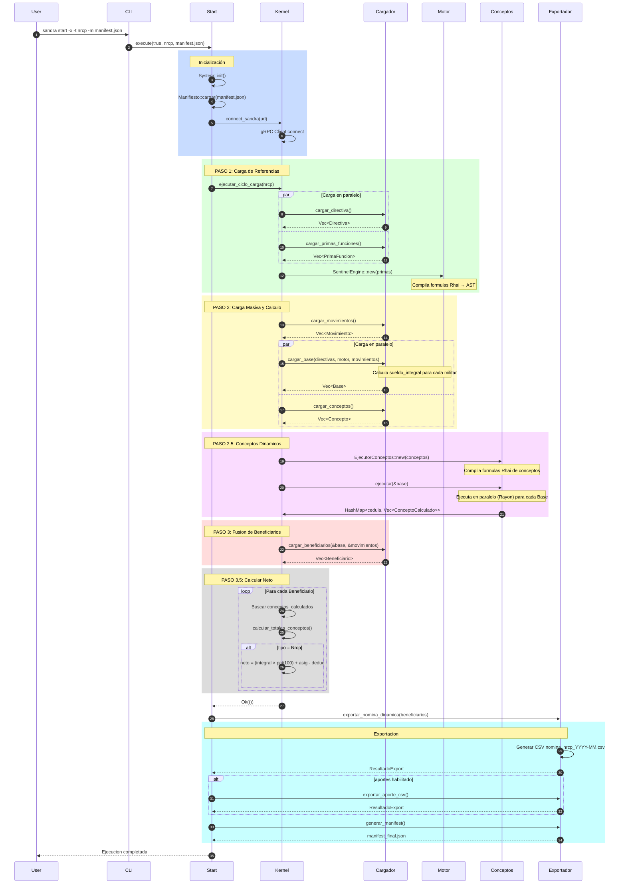

# Diagrama de Secuencia - Sandra Sentinel

```mermaid
sequenceDiagram
    autonumber
    participant User
    participant CLI
    participant Start
    participant Kernel
    participant Cargador
    participant Motor
    participant Conceptos
    participant Exportador

    User->>CLI: sandra start -x -t nrcp -m manifest.json
    CLI->>Start: execute(true, nrcp, manifest.json)

    rect rgb(200, 220, 255)
        Note over Start: Inicialización
        Start->>Start: System::init()
        Start->>Start: Manifiesto::cargar(manifest.json)
        Start->>Kernel: connect_sandra(url)
        Kernel->>Kernel: gRPC Client connect
    end

    rect rgb(220, 255, 220)
        Note over Start,Kernel: PASO 1: Carga de Referencias
        Start->>Kernel: ejecutar_ciclo_carga(nrcp)
        
        par Carga en paralelo
            Kernel->>Cargador: cargar_directiva()
            Cargador-->>Kernel: Vec<Directiva>
        and
            Kernel->>Cargador: cargar_primas_funciones()
            Cargador-->>Kernel: Vec<PrimaFuncion>
        end

        Kernel->>Motor: SentinelEngine::new(primas)
        Note over Motor: Compila formulas Rhai → AST
    end

    rect rgb(255, 250, 200)
        Note over Start,Kernel: PASO 2: Carga Masiva y Calculo
        Kernel->>Cargador: cargar_movimientos()
        Cargador-->>Kernel: Vec<Movimiento>

        par Carga en paralelo
            Kernel->>Cargador: cargar_base(directivas, motor, movimientos)
            Note over Cargador,Motor: Calcula sueldo_integral para cada militar
            Cargador-->>Kernel: Vec<Base>
        and
            Kernel->>Cargador: cargar_conceptos()
            Cargador-->>Kernel: Vec<Concepto>
        end
    end

    rect rgb(250, 220, 255)
        Note over Start,Kernel: PASO 2.5: Conceptos Dinamicos
        Kernel->>Conceptos: EjecutorConceptos::new(conceptos)
        Note over Conceptos: Compila formulas Rhai de conceptos
        
        Kernel->>Conceptos: ejecutar(&base)
        Note over Conceptos: Ejecuta en paralelo (Rayon) para cada Base
        Conceptos->>Kernel: HashMap<cedula, Vec<ConceptoCalculado>>
    end

    rect rgb(255, 220, 220)
        Note over Start,Kernel: PASO 3: Fusion de Beneficiarios
        Kernel->>Cargador: cargar_beneficiarios(&base, &movimientos)
        Cargador-->>Kernel: Vec<Beneficiario>
    end

    rect rgb(220, 220, 220)
        Note over Start,Kernel: PASO 3.5: Calcular Neto
        loop Para cada Beneficiario
            Kernel->>Kernel: Buscar conceptos_calculados
            Kernel->>Kernel: calcular_totales_conceptos()
            
            alt tipo = Nrcp
                Kernel->>Kernel: neto = (integral × pct/100) + asig - deduc
            end
        end
    end

    Kernel-->>Start: Ok(())
    Start->>Exportador: exportar_nomina_dinamica(beneficiarios)

    rect rgb(200, 255, 255)
        Note over Start,Exportador: Exportacion
        Exportador->>Exportador: Generar CSV nomina_nrcp_YYYY-MM.csv
        Exportador-->>Start: ResultadoExport
        
        alt aportes habilitado
            Start->>Exportador: exportar_aporte_csv()
            Exportador-->>Start: ResultadoExport
        end
        
        Start->>Exportador: generar_manifest()
        Exportador-->>Start: manifest_final.json
    end

    Start-->>User: Ejecucion completada
```

